# Express JWT Authentication
Nama : Gusti Ayu Devi Anjani Putri  
NIM  : F1D022006

Project ini merupakan implementasi **Authentication menggunakan JSON Web Token (JWT)** pada Express.js.

---

## Authentication Flow (JWT)

1. User melakukan **register**
2. User melakukan **login**
3. Server mengembalikan **JWT Token**
4. Token disimpan di client
5. Token dikirim melalui header:

```
Authorization: Bearer <token>
```

6. Middleware memverifikasi token sebelum mengakses endpoint tertentu

---

## Daftar Endpoint

### Register User

```
POST /api/auth/register
```

### Login User

```
POST /api/auth/login
```

### Get Profile (Protected)

```
GET /api/auth/profile
```

### Get Cars (Protected)

```
GET /api/cars
```

### Add Cars (Admin Only)

```
POST /api/cars
```

---

## Screenshot Hasil

### Register User


---

### Register Admin

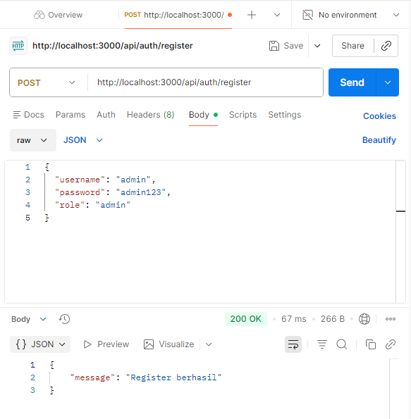

---

### Update Database

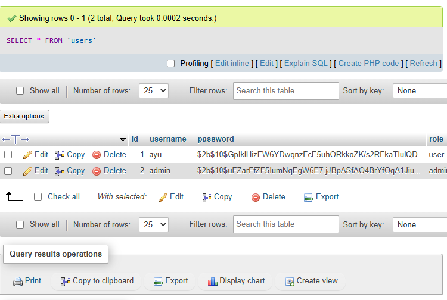

---

### Login User

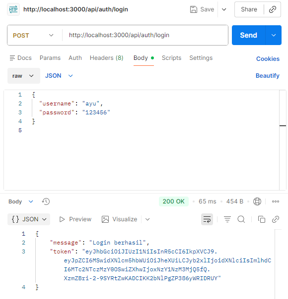

---

### Login Admin

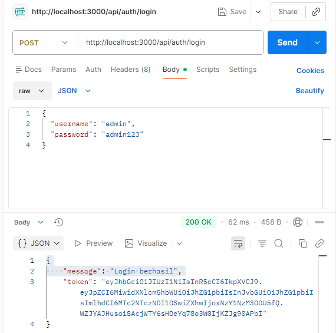

---

### Get Cars Tanpa Token (Unauthorized)

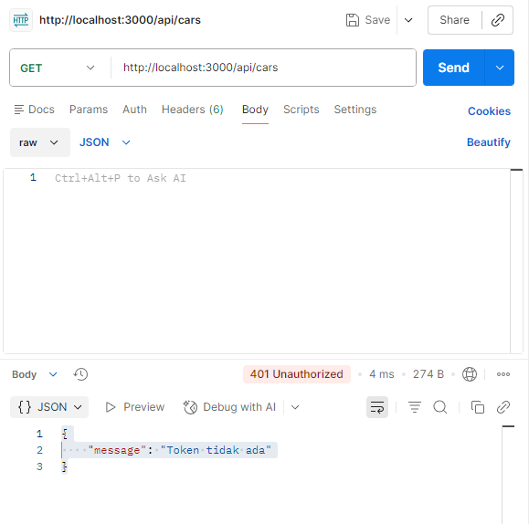

---

### Get Cars Dengan Token User

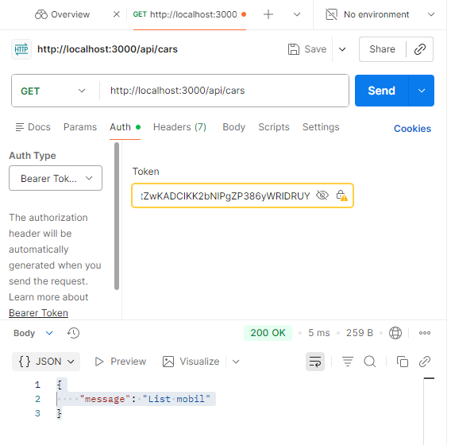

---

### Post Cars Tanpa Token (Unauthorized)

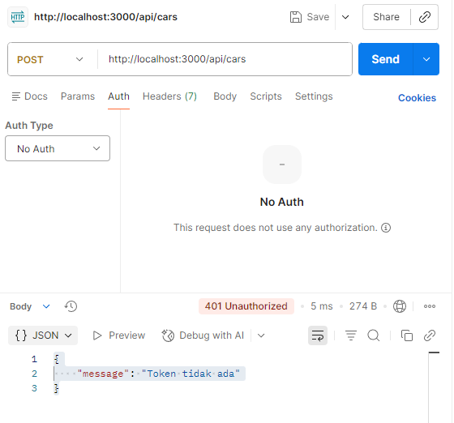

---

### Post Cars Dengan Token User

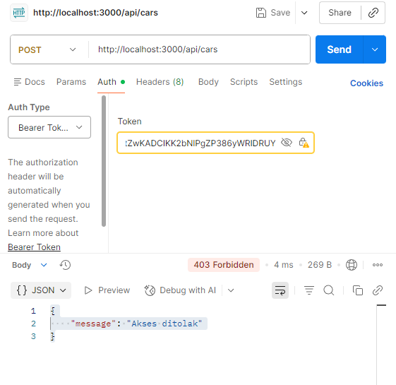

---

### Post Cars Dengan Token Admin

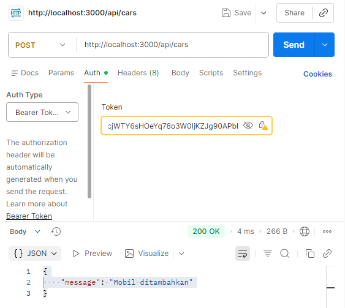

---

### Get Profile User dari Token

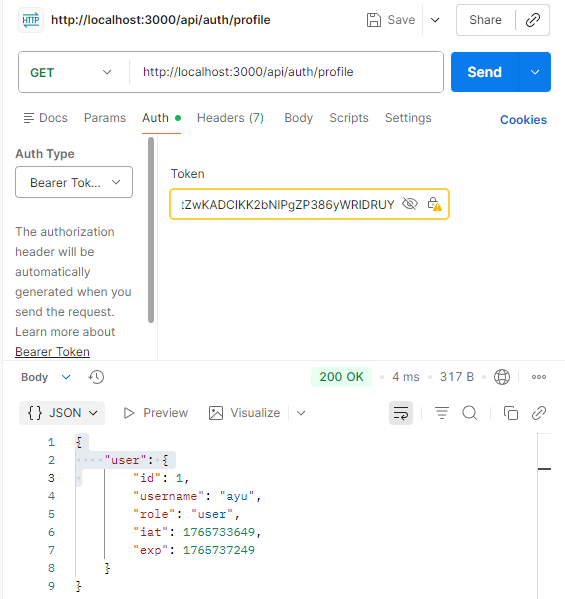

---

### Get Profile Admin dari Token

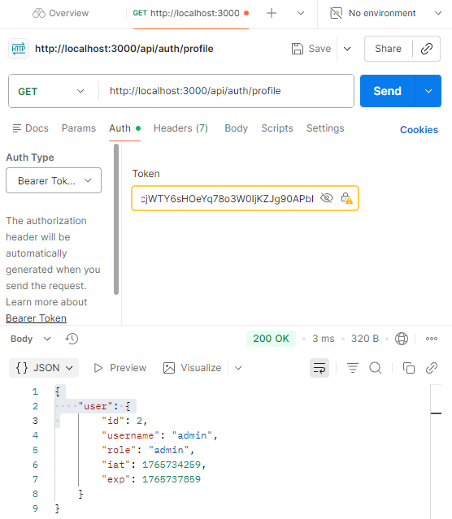

---

## Author

**F1D022006 - Gusti Ayu Devi Anjani Putri**
Teknik Informatika
Universitas Mataram